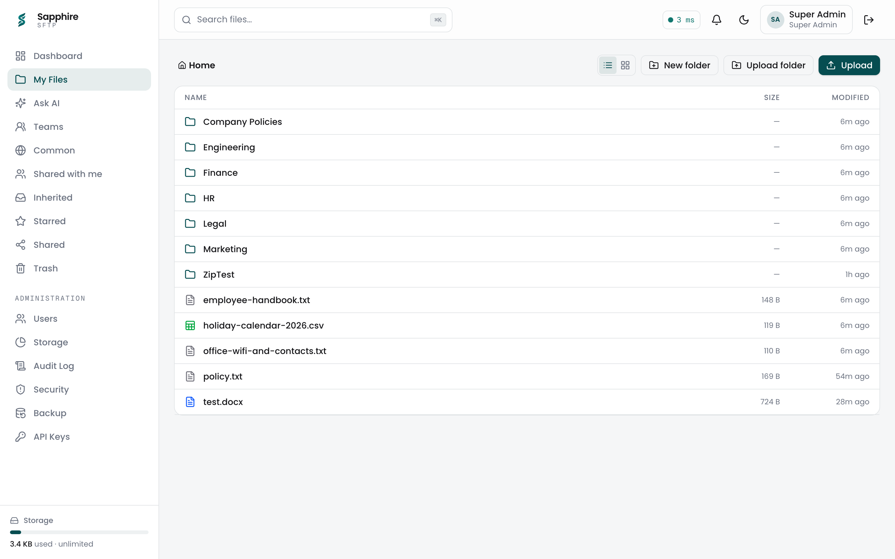
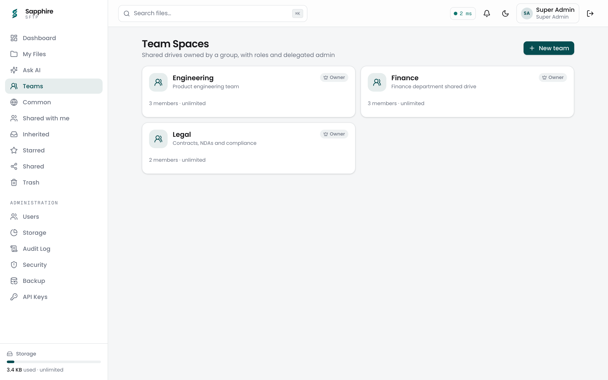
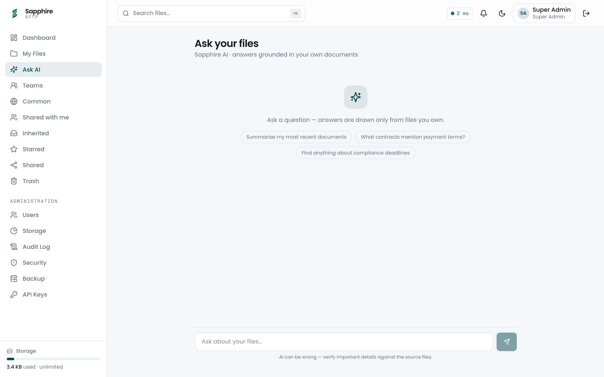
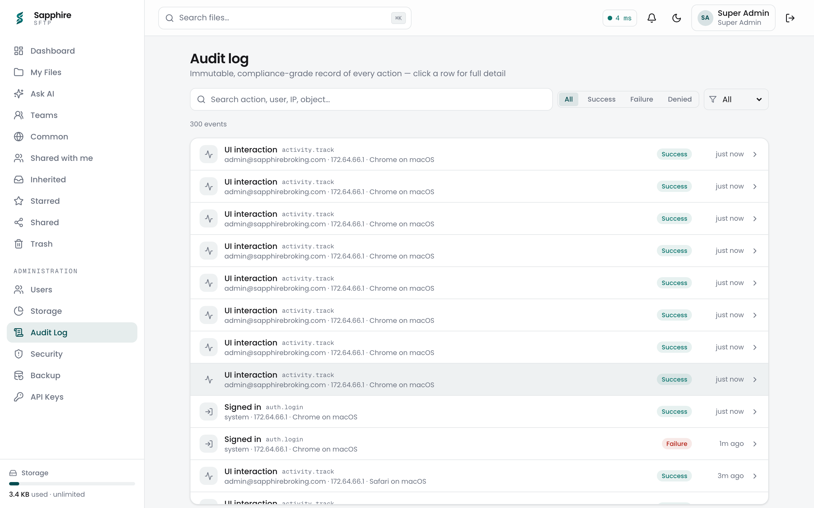
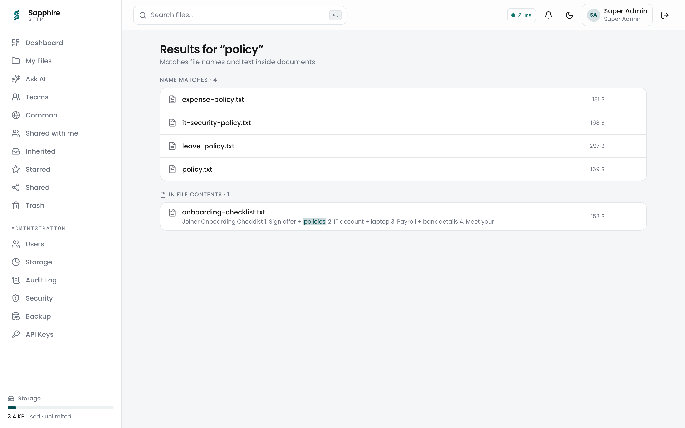
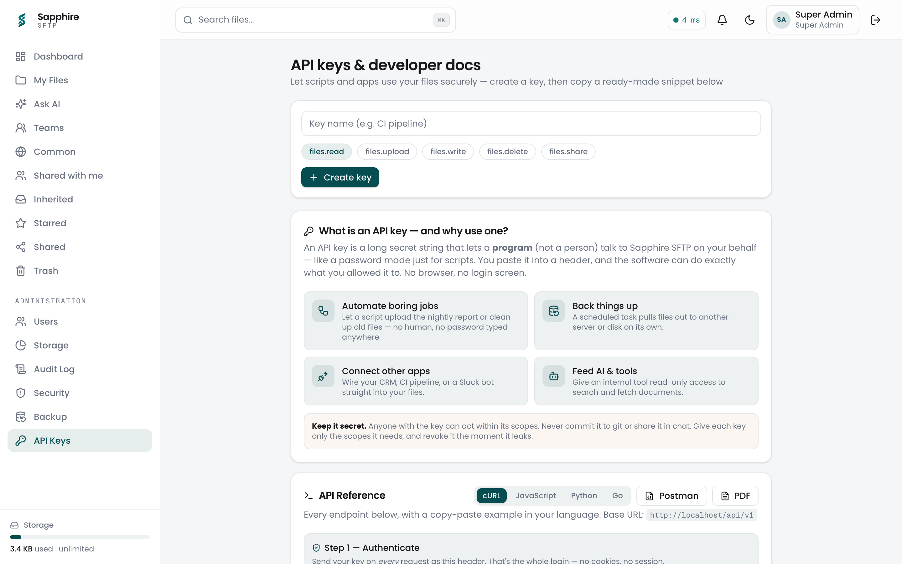
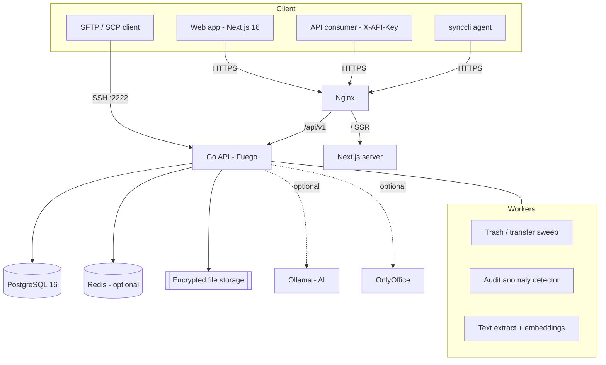
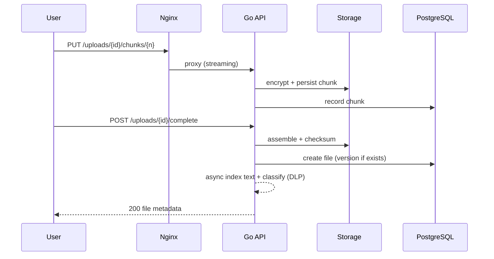

<div align="center">


# Sapphire SFTP

**The self-hosted, compliance-grade file platform for regulated teams.**

Google Drive / Dropbox Business features — one hundred percent on your own infrastructure.
Files, folders, sharing, versioning, audit, encryption, native SFTP, Team Spaces, and on-prem AI.
No cloud. No data leaving your network. Fully white-label.

<br />

[](https://github.com/BrokingSapphire/sftp/actions/workflows/ci.yml)
[](https://github.com/BrokingSapphire/sftp/actions/workflows/codeql.yml)
[](LICENSE)
[](backend/go.mod)
[](frontend/package.json)
[](docker-compose.yml)
[](CONTRIBUTING.md)

[](https://github.com/BrokingSapphire/sftp/stargazers)
[](https://github.com/BrokingSapphire/sftp/network/members)
[](https://github.com/BrokingSapphire/sftp/issues)

<br />

[Quick Start](#quick-start) &nbsp;·&nbsp; [Features](#features) &nbsp;·&nbsp; [Architecture](#architecture) &nbsp;·&nbsp; [Docs](docs/) &nbsp;·&nbsp; [Contributing](CONTRIBUTING.md)

</div>

---

## Table of Contents

- [Introduction](#introduction)
- [Why Sapphire SFTP](#why-sapphire-sftp)
- [Features](#features)
- [Screenshots](#screenshots)
- [Quick Start](#quick-start)
- [Configuration](#configuration)
- [Architecture](#architecture)
- [Folder Structure](#folder-structure)
- [Tech Stack](#tech-stack)
- [Development](#development)
- [Testing](#testing)
- [Security](#security)
- [Roadmap](#roadmap)
- [FAQ](#faq)
- [Troubleshooting](#troubleshooting)
- [Contributing](#contributing)
- [Community](#community)
- [License](#license)
- [Acknowledgements](#acknowledgements)

---

## Introduction

**Sapphire SFTP** is a production-grade, on-premise file management platform in the
spirit of Google Drive and Dropbox Business — but every byte lives on **your**
servers. It combines a modern web experience with a native **SFTP-over-SSH**
endpoint and a first-class REST API, so humans and machines share the same
storage, permissions, and audit trail.

It was built for **regulated organisations** — broking, fintech, legal,
healthcare — where data residency, encryption, and an immutable audit trail are
not optional.

**Who is it for?**

- IT teams who need Drive-like collaboration without sending data to the cloud.
- Security and compliance teams who need audit, retention, DLP, and legal hold.
- Developers who want a clean REST API and SFTP for automation.
- Vendors who need a white-label file platform they can rebrand in minutes.

---

## Why Sapphire SFTP

| Capability | Sapphire SFTP | Typical SaaS Drive | Raw SFTP server |
| --- | :---: | :---: | :---: |
| Self-hosted, no cloud | Yes | No | Yes |
| Modern web UI with previews | Yes | Yes | No |
| Native SFTP protocol | Yes | No | Yes |
| REST API and API keys | Yes | Partial | No |
| RBAC and per-file sharing | Yes | Yes | Partial |
| Team Spaces (group drives) | Yes | Yes | No |
| Immutable audit trail | Yes | Partial | No |
| Encryption at rest (opt-in) | Yes | Yes | Partial |
| Legal hold and WORM retention | Yes | Partial | No |
| PII detection and DLP | Yes | Partial | No |
| On-prem AI (semantic search) | Yes | No | No |
| Encrypted, incremental backups | Yes | Yes | No |
| White-label from one config | Yes | No | No |

---

## Features

**Files and collaboration**

- Drive-style explorer (grid and list, multi-select, drag-and-drop).
- Right-click context menus, folder colours, code-file icons.
- Rich previews: images, PDF, media, text, CSV, JSON, and all Office formats.
- Resumable uploads with pause, resume, and cancel.
- Folder upload, folder ZIP download, and file copy.
- Versioning — re-upload creates versions; restore or download any version.
- In-app editor for text and code (save creates a new version).
- Common organisation-wide area (unlimited, off-quota).
- Sharing — a link or specific people (viewer or editor).
- **Team Spaces** — group-owned shared drives with roles and delegated admin.

**Security and compliance**

- RBAC with least-privilege roles and per-file grants.
- AES-256 encryption at rest (seekable, range-safe).
- Immutable audit trail — every action, including downloads, is logged.
- Audit anomaly detection (exfiltration, brute force, bulk actions).
- Legal hold and WORM retention locks.
- PII detection and DLP (PAN, Aadhaar, cards) that blocks risky shares.
- Single active session per account, forced first-login password change, per-user quotas.

**Access and integration**

- Native SFTP over SSH (same storage and accounts).
- REST API (`/api/v1`) with OpenAPI, plus Postman and PDF export.
- API keys for automation, with copy-paste snippets in cURL, JavaScript, Python, and Go.
- Microsoft Entra ID (Azure AD) SSO, restricted to your org domains.
- Desktop sync agent (`synccli`) to mirror a folder.

**Platform and AI (on-prem)**

- Semantic search and "Ask your files" (RAG) via self-hosted Ollama.
- Live Office co-editing via OnlyOffice (optional).
- Full-text content search (PDF, Office, text) with highlighted snippets.
- Prometheus metrics, rate limiting, Redis or in-memory caching, background workers.
- Encrypted, incremental backups to any disk (super-admin only).
- One-command deploy (`deploy.sh`) and white-label configuration.

---

## Screenshots

> Generated from a running, seeded instance. To (re)capture them, seed demo data,
> then run `node scripts/capture-screenshots.mjs` (see [Development](#development)).

| Files explorer | Team Spaces |
| :---: | :---: |
| [](docs/images/files.png) | [](docs/images/teams.png) |

| Ask your files (AI) | Audit log |
| :---: | :---: |
| [](docs/images/ask.png) | [](docs/images/audit.png) |

| Search inside files | API keys and developer docs |
| :---: | :---: |
| [](docs/images/search.png) | [](docs/images/api.png) |

---

## Quick Start

**Prerequisites:** Docker with Docker Compose, and `python3` (for the guided deploy).

### Option A — Guided one-command deploy (recommended)

```bash
git clone https://github.com/BrokingSapphire/sftp.git
cd sftp
./deploy.sh
```

`deploy.sh` asks a few company questions (name, brand colour, org domains, first
admin, optional SMTP, SSO, encryption, AI), generates `brand.config.json` and
`.env` (secrets auto-generated), then builds and starts everything. When it
finishes it prints your URL and admin credentials.

### Option B — Docker Compose

```bash
cp backend/.env.example .env      # set JWT_SECRET, POSTGRES_PASSWORD, etc.
docker compose up -d --build
```

Then open `http://localhost` and sign in with the bootstrap admin.

### Optional profiles

```bash
docker compose --profile ai up -d            # Ollama (semantic search / Ask AI)
docker compose --profile office up -d        # OnlyOffice (live Office editing)
docker compose --profile monitoring up -d    # Prometheus + Grafana
```

See [docs/INSTALLATION.md](docs/INSTALLATION.md) and
[docs/DEPLOYMENT.md](docs/DEPLOYMENT.md) for production hardening (TLS, backups,
external storage, scaling).

---

## Configuration

The app is driven by two files, plus environment variables:

- **`brand.config.json`** (repo root) — white-label: name, logo, colours, org
  domains, SMTP, SSO, AI, and Office-editor settings. Secrets are stripped from
  the browser bundle automatically.
- **`.env`** — deployment secrets (JWT, database, admin bootstrap, encryption keys).

Key settings:

| Setting | Where | Purpose |
| --- | --- | --- |
| `JWT_SECRET` | `.env` | Signs access tokens (minimum 32 characters). |
| `STORAGE_ENCRYPTION_KEY` | `.env` | Enables AES-256 encryption at rest. |
| `BACKUP_ENCRYPTION_KEY` | `.env` | Encrypts backup archives (independent of at-rest encryption). |
| `ORG_DOMAINS` / `org.domains` | `.env` / brand | Flags external shares, restricts SSO. |
| `sso.microsoft.*` | brand | Microsoft Entra ID SSO (single-tenant recommended). |
| `ai.enabled` / `ai.ollamaUrl` | brand | On-prem semantic search and Ask AI. |
| `editor.*` | brand | OnlyOffice live Office editing. |

Full reference: [docs/ENVIRONMENT.md](docs/ENVIRONMENT.md).

---

## Architecture



Upload request lifecycle:



Deep dive: [docs/ARCHITECTURE.md](docs/ARCHITECTURE.md).

---

## Folder Structure

```text
.
├── backend/              # Go API + SFTP server (Fuego, pgx, sqlc, goose)
│   ├── cmd/server/       # main entrypoint
│   ├── cmd/synccli/      # desktop sync agent
│   ├── internal/
│   │   ├── api/          # HTTP routing, handlers, middleware
│   │   ├── service/      # business logic (file, user, share, team, ai, backup)
│   │   ├── db/           # sqlc-generated queries + query sources
│   │   ├── storage/      # filesystem engine (sharded, encrypted)
│   │   ├── metrics/      # Prometheus instrumentation
│   │   └── worker/       # background jobs
│   ├── pkg/              # reusable libs (argon2, jwt, filecrypt, dlp, ratelimit)
│   └── migrations/       # goose SQL migrations (embedded)
├── frontend/             # Next.js 16 App Router (root app/ routing)
│   ├── app/(app)/        # authenticated pages
│   ├── components/       # UI + feature components
│   └── lib/              # api client, brand config, hooks
├── docs/                 # documentation
├── docker/               # nginx + prometheus config
├── brand.config.json     # white-label single source of truth
├── docker-compose.yml    # full stack
└── deploy.sh             # guided one-command deploy
```

---

## Tech Stack

**Backend** — Go 1.26, [Fuego](https://github.com/go-fuego/fuego) (typed handlers with OpenAPI), pgx/v5, sqlc, goose, Argon2id, HS256 JWT, Zap, Viper, Prometheus.

**Frontend** — Next.js 16 (App Router), TypeScript, Tailwind v4, TanStack Query, React Hook Form with Zod, motion, shadcn-style UI.

**Data and infrastructure** — PostgreSQL 16, Redis (optional), Nginx, Docker Compose.

**Optional** — Ollama (AI), OnlyOffice (editing), Microsoft Entra ID (SSO), SMTP, Grafana.

---

## Development

```bash
# Backend
cd backend
go build ./...          # compile
go vet ./...            # static analysis
go test ./...           # tests
go run ./cmd/server     # run (needs Postgres + config/.env)

# Frontend
cd frontend
npm install
npm run dev             # dev server (http://localhost:3000)
npm run typecheck       # tsc --noEmit
npm test                # vitest
npm run build           # production build
```

- Database access is fully typed via **sqlc** — edit `internal/db/queries/*.sql`
  then run `sqlc generate`.
- Migrations are **goose** files in `backend/migrations/sftp/`, applied at startup.
- The frontend reads branding from `brand.config.json` via a sync script.

**Regenerating screenshots.** With the stack running and demo data seeded, install
Playwright and run the capture script:

```bash
cd frontend && npm i -D playwright && npx playwright install chromium
cd .. && node scripts/capture-screenshots.mjs
```

It logs in, visits each page, and writes PNGs to `docs/images/` (README) and
`frontend/public/onboarding/` (the first-login welcome tour).

More: [CONTRIBUTING.md](CONTRIBUTING.md).

---

## Testing

| Layer | Command | Coverage |
| --- | --- | --- |
| Backend unit | `go test ./...` | crypto, DLP, cache, config, sanitize, storage, audit, ratelimit, metrics |
| Backend race | `go test -race ./...` | concurrency safety |
| Frontend unit | `npm test` (Vitest) | pure utilities |
| Type safety | `npm run typecheck` | full TypeScript project |
| Build | `docker compose build` | image builds |

CI runs all of the above on every push and pull request (see
[`.github/workflows/ci.yml`](.github/workflows/ci.yml)).

---

## Security

- **Encryption at rest** — AES-256-CTR, IV-prefixed, seekable (range-safe).
- **Auth** — Argon2id hashing, short-lived HS256 JWTs, API keys, SFTP keys, single active session.
- **Access control** — RBAC, per-file grants, Team Spaces roles, Common and inherited rules.
- **Compliance** — immutable audit (including downloads), legal hold, WORM retention, PII and DLP.
- **Detection** — background anomaly detection on the audit stream.
- **Backups** — encrypted, incremental, super-admin only.

Found a vulnerability? Please report it privately — see
[SECURITY.md](.github/SECURITY.md). Do not open a public issue.

---

## Roadmap

**Shipped**

- Files, folders, sharing, previews, versioning.
- Native SFTP, REST API, API keys.
- RBAC, audit, encryption, quotas, SSO.
- Full-text search, PII and DLP, legal hold and retention.
- Audit anomaly detection, encrypted incremental backups.
- On-prem AI (semantic search and Ask your files).
- Team Spaces, single active session, download audit logging.
- Desktop sync agent, white-label config, one-command deploy.

**Near-term**

- Two-way desktop sync (pull and conflict resolution).
- SCIM provisioning and SAML, TOTP MFA.
- Object-storage backend (S3 / MinIO) with dedup.
- Team drives (files inside a Team Space) and automation rules.

**Long-term**

- Multi-tenancy (one deployment, many orgs).
- Workflow automation (webhooks and a rules engine).
- Auto-classification and summarisation (AI).

Have an idea? [Open a feature request](https://github.com/BrokingSapphire/sftp/issues/new?template=feature_request.yml).

---

## FAQ

<details>
<summary><b>Is anything sent to the cloud?</b></summary>

No. Everything runs on your infrastructure. Optional AI uses a self-hosted Ollama
container — no data leaves your network.
</details>

<details>
<summary><b>Do the web UI and SFTP share the same files and permissions?</b></summary>

Yes. The web app, REST API, and native SFTP endpoint all use the same storage,
accounts, RBAC, and audit trail.
</details>

<details>
<summary><b>How do I rebrand it for my company?</b></summary>

Edit <code>brand.config.json</code> (name, colours, logo, domains), drop your logo
in <code>frontend/public/</code>, and rebuild. <code>deploy.sh</code> can do this
interactively.
</details>

<details>
<summary><b>What happens if I lose an encryption key?</b></summary>

Encrypted files and backups become unrecoverable. Store
<code>STORAGE_ENCRYPTION_KEY</code> and <code>BACKUP_ENCRYPTION_KEY</code> securely.
</details>

<details>
<summary><b>Can I restrict SSO to my company only?</b></summary>

Yes — use a single-tenant Azure app and set your tenant GUID; sign-in is further
restricted to <code>org.domains</code> by default.
</details>

More in [docs/FAQ.md](docs/FAQ.md).

---

## Troubleshooting

Common issues (timeouts, uploads, PDF preview, SSO, disk) and fixes are in
[docs/TROUBLESHOOTING.md](docs/TROUBLESHOOTING.md).

---

## Contributing

Contributions are welcome — from typo fixes to features.

1. Fork the repo and create a branch: `git checkout -b feat/my-thing`.
2. Make your change; keep commits in [Conventional Commits](https://www.conventionalcommits.org/) style.
3. Run the checks (`go test ./...`, `npm run typecheck && npm test`).
4. Open a pull request with a clear description; fill in the template.
5. A maintainer reviews, we iterate, and merge.

Read [CONTRIBUTING.md](CONTRIBUTING.md) and the [Code of Conduct](CODE_OF_CONDUCT.md)
before you start.

---

## Community

- [Discussions](https://github.com/BrokingSapphire/sftp/discussions) — questions, ideas, show-and-tell.
- [Issues](https://github.com/BrokingSapphire/sftp/issues) — bugs and features.
- [Security advisories](.github/SECURITY.md) — private disclosure.
- [Support](SUPPORT.md) — where to get help.

---

## License

Released under the [MIT License](LICENSE). Copyright Sapphire Broking and contributors.

---

## Acknowledgements

Built with the work of the open-source community, including
[Go](https://go.dev), [Fuego](https://github.com/go-fuego/fuego),
[Next.js](https://nextjs.org), [PostgreSQL](https://www.postgresql.org),
[Tailwind CSS](https://tailwindcss.com), [sqlc](https://sqlc.dev),
[goose](https://github.com/pressly/goose), [Ollama](https://ollama.com), and
[OnlyOffice](https://www.onlyoffice.com).

<div align="center">
<br />
<sub>If Sapphire SFTP is useful to you, please consider giving it a star — it helps others discover the project.</sub>
</div>
