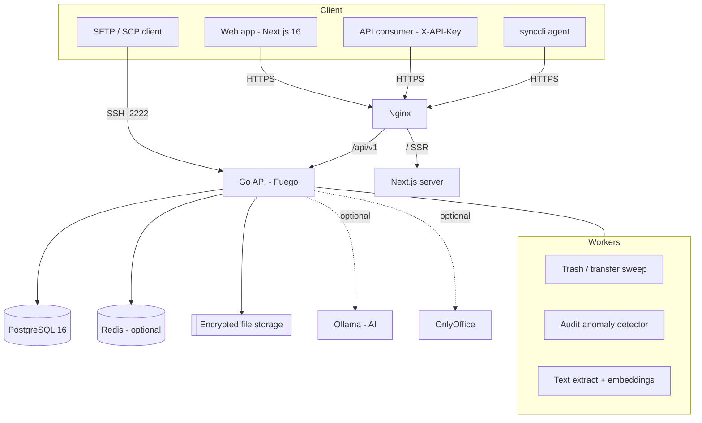
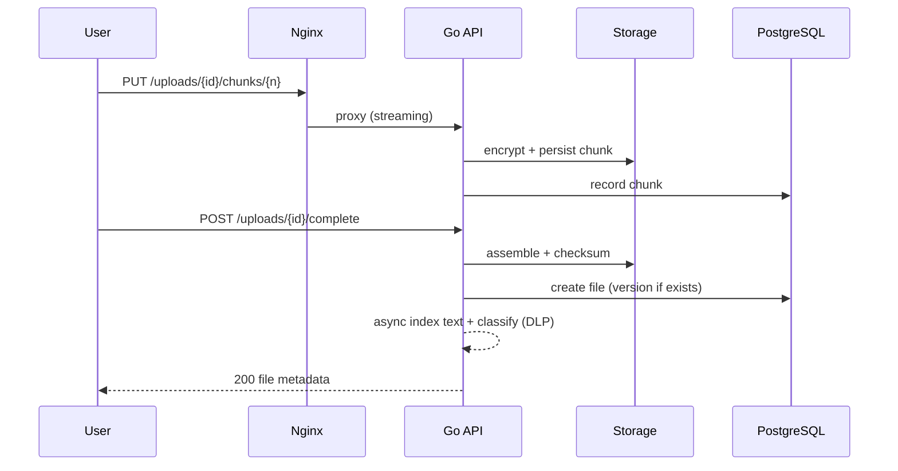

<div align="center">


# Sapphire SFTP

### The self-hosted, compliance-grade file platform for regulated teams

**Google Drive / Dropbox Business features — 100% on your own infrastructure.**
Files, folders, sharing, versioning, audit, encryption, native SFTP, and on-prem AI.
No cloud. No data leaving your network. Fully white-label.

<br />

[](https://github.com/BrokingSapphire/sftp/actions/workflows/ci.yml)
[](https://github.com/BrokingSapphire/sftp/actions/workflows/codeql.yml)
[](LICENSE)
[](backend/go.mod)
[](frontend/package.json)
[](docker-compose.yml)
[](CONTRIBUTING.md)

[](https://github.com/BrokingSapphire/sftp/stargazers)
[](https://github.com/BrokingSapphire/sftp/network/members)
[](https://github.com/BrokingSapphire/sftp/issues)

<br />

[**Quick Start**](#-quick-start) · [**Features**](#-features) · [**Architecture**](#%EF%B8%8F-architecture) · [**Docs**](docs/) · [**Contributing**](CONTRIBUTING.md)

</div>

---

## 📑 Table of Contents

- [Introduction](#-introduction)
- [Why Sapphire SFTP?](#-why-sapphire-sftp)
- [Features](#-features)
- [Screenshots](#-screenshots)
- [Quick Start](#-quick-start)
- [Configuration](#-configuration)
- [Architecture](#%EF%B8%8F-architecture)
- [Folder Structure](#-folder-structure)
- [Tech Stack](#-tech-stack)
- [Development](#-development)
- [Testing](#-testing)
- [Security](#-security)
- [Roadmap](#-roadmap)
- [FAQ](#-faq)
- [Troubleshooting](#-troubleshooting)
- [Contributing](#-contributing)
- [Community](#-community)
- [License](#-license)
- [Acknowledgements](#-acknowledgements)

---

## 🚀 Introduction

**Sapphire SFTP** is a production-grade, on-premise file management platform in
the spirit of Google Drive and Dropbox Business — but every byte lives on
**your** servers. It combines a modern web experience with a native
**SFTP-over-SSH** endpoint and a first-class REST API, so humans and machines
share the same storage, permissions, and audit trail.

It was built for **regulated organisations** — broking, fintech, legal,
healthcare — where data residency, encryption, and an immutable audit trail are
not optional.

**Who is it for?**

- 🏢 IT teams who need Drive-like collaboration without sending data to the cloud
- 🛡️ Security & compliance teams who need audit, retention, DLP, and legal hold
- 🤖 Developers who want a clean REST API + SFTP for automation
- 🎨 Vendors who need a **white-label** file platform they can rebrand in minutes

---

## 💡 Why Sapphire SFTP?

| | Sapphire SFTP | Typical SaaS Drive | Raw SFTP server |
| --- | :---: | :---: | :---: |
| Self-hosted, no cloud | ✅ | ❌ | ✅ |
| Modern web UI + previews | ✅ | ✅ | ❌ |
| Native SFTP protocol | ✅ | ❌ | ✅ |
| REST API + API keys | ✅ | ⚠️ | ❌ |
| RBAC + per-file sharing | ✅ | ✅ | ⚠️ |
| Immutable audit trail | ✅ | ⚠️ | ❌ |
| Encryption at rest (opt-in) | ✅ | ✅ | ⚠️ |
| Legal hold + WORM retention | ✅ | ⚠️ | ❌ |
| PII detection + DLP | ✅ | ⚠️ | ❌ |
| On-prem AI (semantic search) | ✅ | ❌ | ❌ |
| Encrypted, incremental backups | ✅ | ✅ | ❌ |
| White-label from one config | ✅ | ❌ | ❌ |

---

## ✨ Features

<table>
<tr><td valign="top" width="50%">

### 📁 Files & collaboration
- Drive-style explorer (grid/list, multi-select, drag-and-drop)
- Right-click context menus, folder colours, code-file icons
- Rich **previews**: images, PDF, media, text/CSV/JSON, and **all Office formats**
- **Resumable uploads** with pause / resume / cancel
- Folder upload + folder **ZIP download**, file copy
- **Versioning** — re-upload creates versions; restore/download any version
- In-app **editor** for text/code (save = new version)
- **Common** org-wide area (unlimited, off-quota)
- Right-click **share** — link or specific people (viewer/editor)
- **Team Spaces** — group-owned shared drives with roles + delegated admin

</td><td valign="top" width="50%">

### 🛡️ Security & compliance
- RBAC with least-privilege roles + per-file grants
- **AES-256 encryption at rest** (seekable, range-safe)
- Immutable, **SEBI-style audit trail** — every click logged
- **Audit anomaly detection** (exfiltration, brute-force, bulk actions)
- **Legal hold + WORM retention** locks
- **PII detection + DLP** (PAN/Aadhaar/cards) blocks risky shares
- Forced first-login password change, per-user quotas
- External-share alerts + email notifications

</td></tr>
<tr><td valign="top">

### 🔌 Access & integration
- **Native SFTP over SSH** (same storage & accounts)
- **REST API** (`/api/v1`) with OpenAPI, Postman + PDF export
- **API keys** for automation
- **Microsoft Entra ID (Azure AD) SSO**, org-domain restricted
- **Desktop sync agent** (`synccli`) — mirror a folder, `--watch`
- **Live ping** indicator, notifications bell

</td><td valign="top">

### 🤖 Platform & AI (on-prem)
- **Semantic search + "Ask your files"** RAG via self-hosted Ollama
- Live **Office co-editing** via OnlyOffice (optional)
- Full-text content search (PDF/Office/text) with snippets
- Redis (or in-memory) caching; background workers
- **Encrypted, incremental backups** to any disk (super-admin)
- **One-command deploy** (`deploy.sh`) + white-label config

</td></tr>
</table>

---

## 📸 Screenshots

> Screenshots live in [`docs/images/`](docs/images/). To regenerate them, run the
> stack locally (see [Quick Start](#-quick-start)) and capture the Dashboard,
> Files explorer, Share dialog, Audit log, and Ask-AI pages.

| Files explorer | Ask your files (AI) | Audit log |
| :---: | :---: | :---: |
| _add `docs/images/files.png`_ | _add `docs/images/ask.png`_ | _add `docs/images/audit.png`_ |

---

## ⚡ Quick Start

**Prerequisites:** Docker + Docker Compose, and `python3` (for the guided deploy).

### Option A — Guided one-command deploy (recommended)

```bash
git clone https://github.com/BrokingSapphire/sftp.git
cd sftp
./deploy.sh
```

`deploy.sh` asks a few company questions (name, brand colour, org domains, first
admin, optional SMTP/SSO/encryption/AI), generates `brand.config.json` + `.env`
(secrets auto-generated), then builds and starts everything. When it finishes it
prints your URL and admin credentials.

### Option B — Docker Compose

```bash
cp backend/.env.example .env      # set JWT_SECRET, POSTGRES_PASSWORD, etc.
docker compose up -d --build
```

Then open **http://localhost** and sign in with the bootstrap admin.

### Optional profiles

```bash
docker compose --profile ai up -d       # + Ollama (semantic search / Ask AI)
docker compose --profile office up -d    # + OnlyOffice (live Office editing)
```

> See [docs/INSTALLATION.md](docs/INSTALLATION.md) and
> [docs/DEPLOYMENT.md](docs/DEPLOYMENT.md) for production hardening (TLS, backups,
> external storage, scaling).

---

## 🔧 Configuration

The entire app is driven by two files, plus environment variables:

- **`brand.config.json`** (repo root) — white-label: name, logo, colours, org
  domains, SMTP, SSO, AI, and Office-editor settings. Secrets are stripped from
  the browser bundle automatically.
- **`.env`** — deployment secrets (JWT, database, admin bootstrap, encryption key).

A few of the most important settings:

| Setting | Where | Purpose |
| --- | --- | --- |
| `JWT_SECRET` | `.env` | Signs access tokens (min 32 chars) |
| `STORAGE_ENCRYPTION_KEY` | `.env` | Enables AES-256 at rest **and** encrypted backups |
| `ORG_DOMAINS` / `org.domains` | `.env` / brand | Flags external shares, restricts SSO |
| `sso.microsoft.*` | brand | Microsoft Entra ID SSO (single-tenant recommended) |
| `ai.enabled` / `ai.ollamaUrl` | brand | On-prem semantic search + Ask AI |
| `editor.*` | brand | OnlyOffice live Office editing |

📖 Full reference: [docs/ENVIRONMENT.md](docs/ENVIRONMENT.md).

---

## 🏗️ Architecture



**Request lifecycle (upload):**



Deep dive: [docs/ARCHITECTURE.md](docs/ARCHITECTURE.md).

---

## 📂 Folder Structure

```text
.
├── backend/              # Go API + SFTP server (Fuego, pgx, sqlc, goose)
│   ├── cmd/server/       # main entrypoint
│   ├── cmd/synccli/      # desktop sync agent
│   ├── internal/
│   │   ├── api/          # HTTP routing, handlers, middleware
│   │   ├── service/      # business logic (file, user, share, ai, backup, …)
│   │   ├── db/           # sqlc-generated queries + query sources
│   │   ├── storage/      # filesystem engine (sharded, encrypted)
│   │   └── worker/       # background jobs
│   ├── pkg/              # reusable libs (argon2, jwt, filecrypt, dlp, cache, …)
│   └── migrations/       # goose SQL migrations (embedded)
├── frontend/             # Next.js 16 App Router (root app/ routing)
│   ├── app/(app)/        # authenticated pages
│   ├── components/       # UI + feature components
│   └── lib/              # api client, brand config, hooks
├── docs/                 # documentation
├── docker/               # nginx image + config
├── brand.config.json     # white-label single source of truth
├── docker-compose.yml    # full stack (postgres + backend + frontend + nginx)
└── deploy.sh             # guided one-command deploy
```

Full explanation: [docs/ARCHITECTURE.md](docs/ARCHITECTURE.md).

---

## 🧰 Tech Stack

**Backend** — Go 1.26 · [Fuego](https://github.com/go-fuego/fuego) (typed handlers + OpenAPI) · pgx/v5 · sqlc · goose · Argon2id · HS256 JWT · Zap · Viper

**Frontend** — Next.js 16 (App Router) · TypeScript · Tailwind v4 · TanStack Query · React Hook Form + Zod · motion · shadcn-style UI

**Data & infra** — PostgreSQL 16 · Redis (optional) · Nginx · Docker Compose

**Optional** — Ollama (AI) · OnlyOffice (editing) · Microsoft Entra ID (SSO) · SMTP

---

## 👩‍💻 Development

```bash
# Backend
cd backend
go build ./...          # compile
go vet ./...            # static analysis
go test ./...           # tests
go run ./cmd/server     # run (needs a Postgres + config/.env)

# Frontend
cd frontend
npm install
npm run dev             # dev server (http://localhost:3000)
npm run typecheck       # tsc --noEmit
npm test                # vitest
npm run build           # production build
```

- Database access is fully typed via **sqlc** — edit `internal/db/queries/*.sql`
  then run `sqlc generate`.
- Migrations are **goose** files in `backend/migrations/sftp/`, applied
  automatically at startup.
- The frontend reads branding from `brand.config.json` via a sync script
  (`npm run sync-brand`, run automatically on dev/build).

More: [CONTRIBUTING.md](CONTRIBUTING.md).

---

## 🧪 Testing

| Layer | Command | What it covers |
| --- | --- | --- |
| Backend unit | `go test ./...` | crypto, DLP, cache, config, sanitize, storage, audit, extract |
| Backend race | `go test -race ./...` | concurrency safety |
| Frontend unit | `npm test` (Vitest) | pure utilities |
| Type safety | `npm run typecheck` | full TS project |
| Build | `docker compose build` | image builds |

CI runs all of the above on every push and PR (see
[`.github/workflows/ci.yml`](.github/workflows/ci.yml)).

---

## 🔐 Security

- **Encryption at rest** — AES-256-CTR, IV-prefixed, seekable (range-safe).
- **Auth** — Argon2id hashing, short-lived HS256 JWTs, API keys, SFTP keys.
- **Access control** — RBAC + per-file grants + Common/inherited rules.
- **Compliance** — immutable audit, legal hold, WORM retention, PII/DLP.
- **Detection** — background anomaly detection on the audit stream.
- **Backups** — encrypted, incremental, super-admin only.

Found a vulnerability? Please report it privately — see
[SECURITY.md](.github/SECURITY.md). Do **not** open a public issue.

---

## 🗺️ Roadmap

**Shipped**

- [x] Files, folders, sharing, previews, versioning
- [x] Native SFTP + REST API + API keys
- [x] RBAC, audit, encryption, quotas, SSO
- [x] Full-text search, PII/DLP, legal hold + retention
- [x] Audit anomaly detection, encrypted incremental backups
- [x] On-prem AI (semantic search + Ask your files)
- [x] Desktop sync agent, white-label config, one-command deploy

**Near-term**

- [ ] Two-way desktop sync (pull + conflict resolution)
- [ ] SCIM provisioning + SAML, TOTP MFA
- [ ] Object-storage backend (S3 / MinIO) with dedup

**Long-term**

- [ ] Multi-tenancy (one deployment, many orgs)
- [ ] Workflow automation (webhooks + rules engine)
- [ ] Auto-classification & summarisation (AI)

Have an idea? [Open a feature request](https://github.com/BrokingSapphire/sftp/issues/new?template=feature_request.yml).

---

## ❓ FAQ

<details>
<summary><b>Is anything sent to the cloud?</b></summary>

No. Everything runs on your infrastructure. Optional AI uses a <b>self-hosted</b>
Ollama container — no data leaves your network.
</details>

<details>
<summary><b>Do the web UI and SFTP share the same files and permissions?</b></summary>

Yes. The web app, REST API, and native SFTP endpoint all use the same storage,
accounts, RBAC, and audit trail.
</details>

<details>
<summary><b>How do I rebrand it for my company?</b></summary>

Edit <code>brand.config.json</code> (name, colours, logo, domains), drop your
logo in <code>frontend/public/</code>, and rebuild. <code>deploy.sh</code> can do
this interactively.
</details>

<details>
<summary><b>What happens if I lose the encryption key?</b></summary>

Encrypted files and backups become unrecoverable. Back up
<code>STORAGE_ENCRYPTION_KEY</code> securely.
</details>

<details>
<summary><b>Can I restrict SSO to my company only?</b></summary>

Yes — use a single-tenant Azure app and set your tenant GUID; sign-in is further
restricted to <code>org.domains</code> by default.
</details>

More in [docs/FAQ.md](docs/FAQ.md).

---

## 🩺 Troubleshooting

Common issues (timeouts, uploads, PDF preview, SSO, disk) and fixes are in
[docs/TROUBLESHOOTING.md](docs/TROUBLESHOOTING.md).

---

## 🤝 Contributing

Contributions are very welcome — from typo fixes to features. Start here:

1. **Fork** the repo and create a branch: `git checkout -b feat/my-thing`
2. Make your change; keep commits **[Conventional Commits](https://www.conventionalcommits.org/)** style
3. Run the checks (`go test ./...`, `npm run typecheck && npm test`)
4. **Open a PR** with a clear description; fill in the template
5. A maintainer reviews, we iterate, and merge 🎉

Read [CONTRIBUTING.md](CONTRIBUTING.md) and the
[Code of Conduct](CODE_OF_CONDUCT.md) before you start.

---

## 🌐 Community

- 💬 [Discussions](https://github.com/BrokingSapphire/sftp/discussions) — questions, ideas, show-and-tell
- 🐛 [Issues](https://github.com/BrokingSapphire/sftp/issues) — bugs & features
- 🔒 [Security advisories](.github/SECURITY.md) — private disclosure
- 🆘 [Support](SUPPORT.md) — where to get help

---

## 📄 License

Released under the [MIT License](LICENSE). © Sapphire Broking and contributors.

---

## 🙏 Acknowledgements

Built with the excellent work of the open-source community, including
[Go](https://go.dev), [Fuego](https://github.com/go-fuego/fuego),
[Next.js](https://nextjs.org), [PostgreSQL](https://www.postgresql.org),
[Tailwind CSS](https://tailwindcss.com), [sqlc](https://sqlc.dev),
[goose](https://github.com/pressly/goose), [Ollama](https://ollama.com), and
[OnlyOffice](https://www.onlyoffice.com).

<div align="center">
<br />
<sub>If Sapphire SFTP is useful to you, please consider giving it a ⭐ — it helps others discover the project.</sub>
</div>
